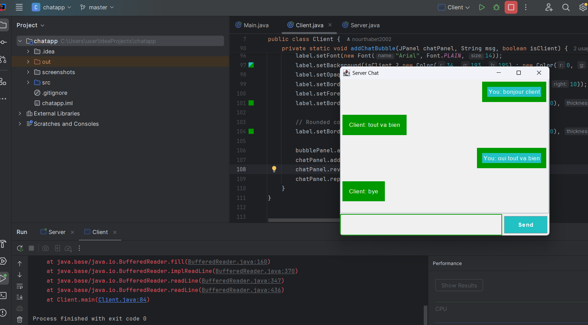

# My Project

This is a description of my project.

## Screenshot of My Work
Here is a screenshot showing the result of my project:




## Description
# Chat Application (Server & Client)

This project implements a simple **chat application** using **Java** that allows communication between a server and a client. The server listens for incoming connections, and the client can send messages to the server, which are then displayed in a GUI chat window.

### Features:
- Real-time chat between client and server.
- Beautiful GUI using Java Swing components.
- Supports sending and receiving messages.

### Technologies Used:
- **Java** for backend and GUI development.
- **Java Swing** for creating the chat interface.
- **Java Networking** for socket communication.
## Installation
To run this project, follow these steps:

1. Clone this repository to your local machine:
   ```bash
   git clone https://github.com/nourthabet2002/chat-app.git
