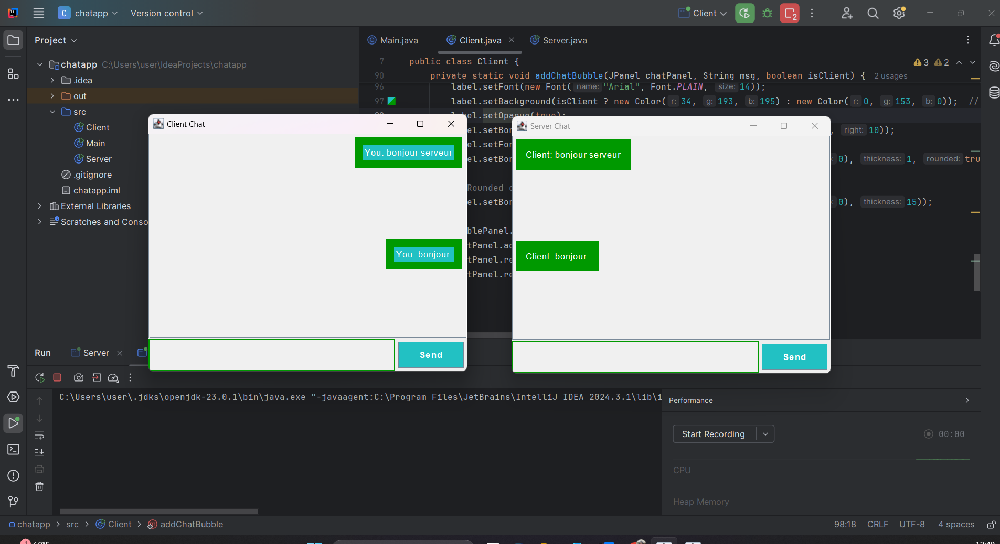

# My Project

This is a description of my project.

## Screenshot of My Work
Here is a screenshot showing the result of my project:



## Description
Provide details about the project here. What does it do? How does it work?

## Installation
To run this project, follow these steps:

1. Clone this repository to your local machine:
   ```bash
   git clone https://github.com/nourthabet2002/chat-app.git
